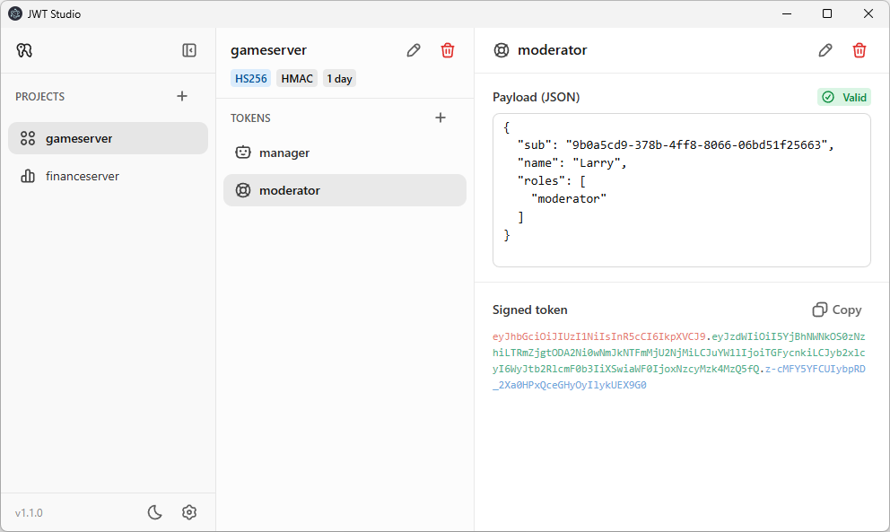

# JWT Studio

A desktop app for generating and managing JWT's across multiple projects with different signing algorithms.

## Features

- Organize tokens by project
- Supports HMAC, RSA, ECDSA, RSA-PSS
- Edit token payloads with live validation
- One-click copy JWT
- Light and dark mode

